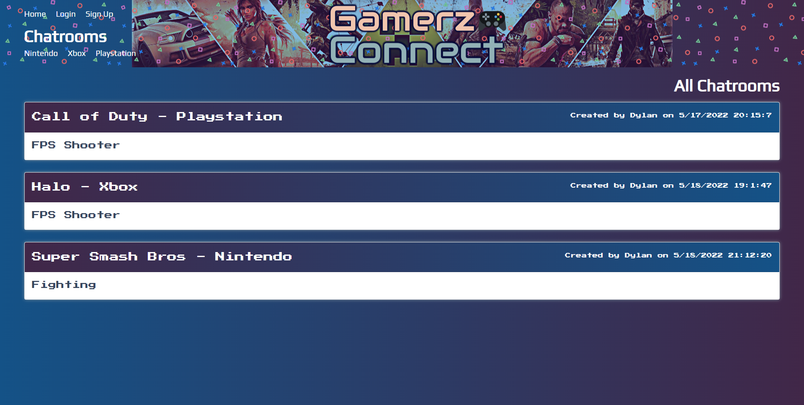
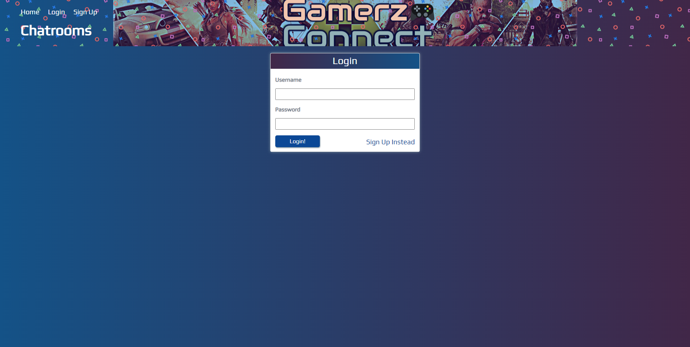
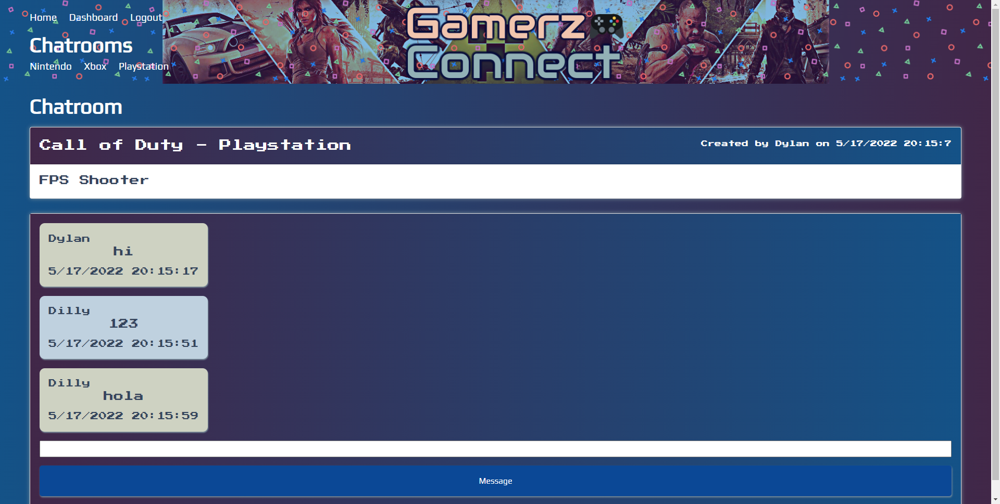

# Video Game Chats

## Description
  
Video Games chatrooms site where gamers can create their game chatrooms and chat on other developers chatrooms as well.

## Built with

- JavaScript
- Node
- Express (Sequelize, Mysql2, Handlebars, Session, Bcrypt)
- Mysql
- MVC Paradigm

## Table of Contents

* [Installation](#installation)
* [Usage](#usage)
* [Walkthrough Video](#walkthrough)
* [Contributing](#contributing)
* [Tests](#tests)
* [Credits](#credits)
* [Code](#code)
* [License](#license)
* [Screenshots](#screenshots)

## Installation

Clone repository to local machine to use local.

## Usage

Execute into mysql source db.schema to create the dabase.
Execute into mysql source db.seed to create the dabase.
Execute on project path the following command "npm start" to create the database structure (tables).
Open Heroku link to view the deployed project.

## Live application

https://secret-coast-34340.herokuapp.com

## Contributing

In short, when you submit code changes, your submissions are understood to be under the same License that covers the project. Feel free to contact the maintainers if that's a concern.

## Tests

Validate helper date format running the follow command "run test".

## Credits

Made by

- Grace Marcoux
- Anh Vuong
- Vicente Garcia Sepulveda
- Peter McClelland
- Dylan Truong

## Code

#### Github repository

- https://github.com/vicengs/Video-Game-Chats

#### SSH to clone:

    git@github.com:vicengs/Tech_Blog.git

## License

MIT License - A short and simple permissive license with conditions only requiring preservation of copyright and license notices. Licensed works, modifications, and larger works may be distributed under different terms and without source code.

## Screenshots
    

